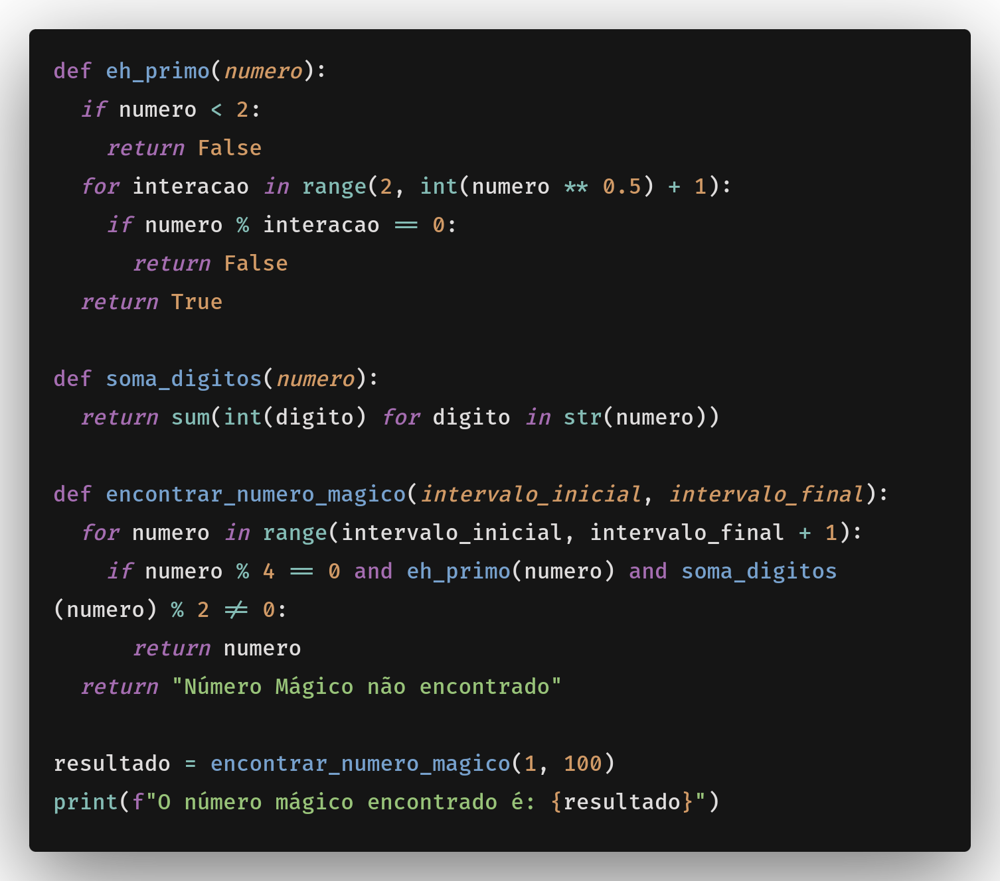

# Explicação do desafio

## Imagem do código:


Primeiramente, o código é dividido em partes, possuindo 3 funções:

- eh_primo(numero)
- soma_digitos(numero)
- encontrar_numero_magico(intervalo_inicial, intervalo_final)

### Função eh_primo()
A função eh_primo() é responsável por verificar se um número é primo ou não. Ela recebe um parâmetro, numero, que representa o número que será verificado. A função verifica se o número é maior que 1, e se não for, ela retorna False. Em seguida, ela itera sobre todos os números inteiros entre 2 e a raiz quadrada do número, incluindo os números inteiros. Para cada número, ela verifica se ele é divisível por ele mesmo e por 2, e se não for, ela retorna False. Se todas as verificações forem verdadeiras, a função retorna True.

### Função soma_digitos()
A função soma_digitos() é responsável por somar todos os dígitos de um número. Ela recebe um parâmetro, numero, que representa o número que será somado. A função retorna o resultado da soma dos dígitos do número.

### Função encontrar_numero_magico()
A função encontrar_numero_magico() é responsável por encontrar o número mágico na rede Polkadot. Ela recebe dois parâmetros, intervalo_inicial e intervalo_final, que representam o intervalo de números que serão considerados para o cálculo do número mágico. Na função, o código é dividido em três blocos:


## Rodando o código:
Rodando o código já temos uma variável que recebe o intervalo inicial e final, e então calcula o número mágico. Colocando o valor inicial como 1 e o final como 100, o resultado será o número mágico encontrado. Como no exemplo abaixo de output do código:

```python
O número mágico encontrado é: Número Mágico não encontrado
```

O motivo pelo qual o número mágico não foi encontrado é porque o intervalo inicial e final não contém nenhum número mágico. E o motivo de não ter encontrado nenhum número mágico é porque não existe um número primo que seja divisível por 4. Sendo assim o código não encontrará nenhum número mágico.
