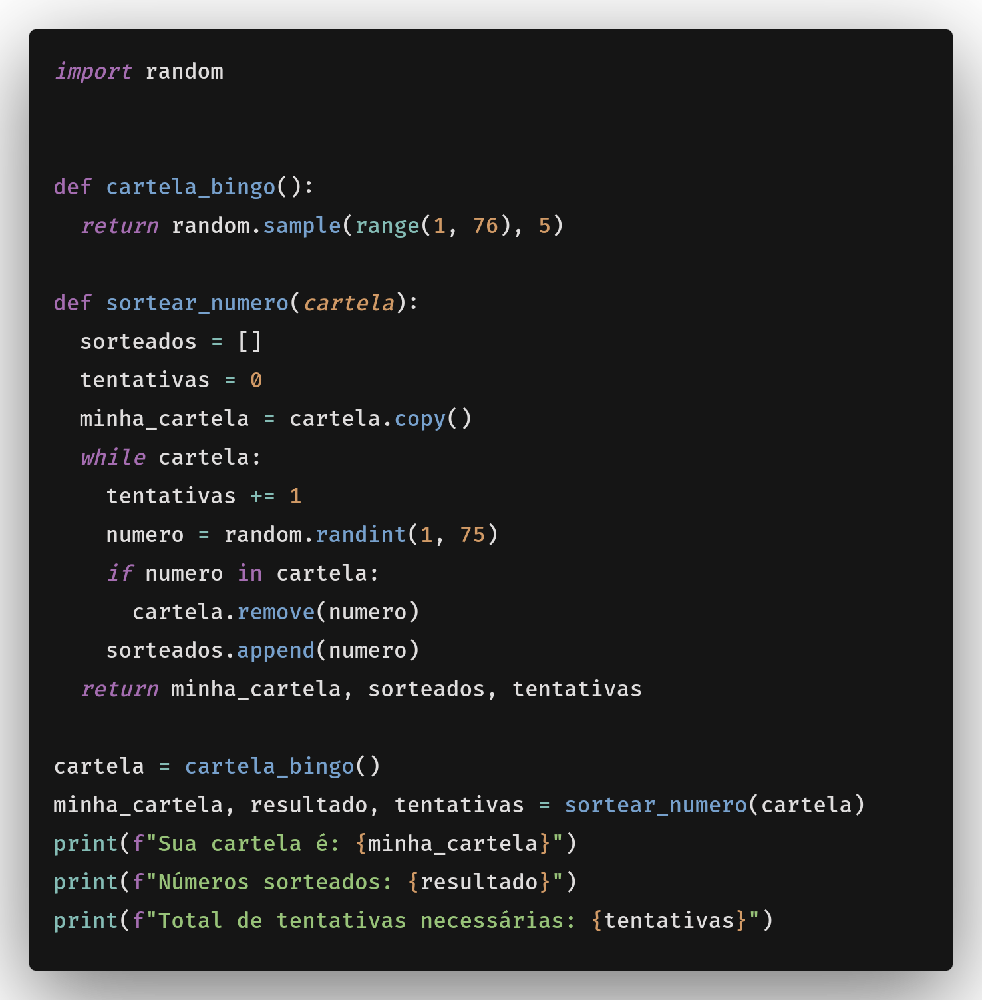

# Explicação do desafio

## Imagem do código:


Primeiramente, o código é dividido em partes, possuindo 1 import 2 funções:

- import random
- cartela_bingo()
- sortear_numero(cartela)

### Import random
O import random é usado para gerar números aleatórios. Para que seja utilizado o random.sample(), que é uma função do módulo random que retorna uma lista de elementos aleatórios de uma lista.

### Função cartela_bingo()
A função cartela_bingo() é responsável por gerar uma cartela de bingo aleatória. Ela retorna uma lista com 5 números aleatórios entre 1 e 75. Ela utiliza o módulo random para gerar números aleatórios.

### Função sortear_numero()
É responsável por sortear um número aleatório de uma lista de números. Ela recebe uma lista de números, cartela, e retorna uma lista com os números sorteados, a lista de números que ainda estão na cartela e o número de tentativas necessárias para sortear o número.

## Rodando o código:
Rodando o código ele irá gerar uma cartela de bingo aleatória e sortear um número aleatório de uma lista de números. O output será uma lista com os números sorteados, a lista de números que ainda estão na cartela e o número de tentativas necessárias para sortear o número. Como no exemplo abaixo:

Vemos que a minha cartela recebeu 5 números, dentre eles são os números 8, 37, 69, 71 e 4. Para que eu conseguisse fazer bingo, foi necessário 16 tentativas. Como no exemplo abaixo:

```python
Sua cartela é: [8, 37, 69, 71, 4]
Números sorteados: [71, 67, 44, 66, 69, 4, 72, 73, 8, 11, 40, 65, 12, 7, 33, 37]
Total de tentativas necessárias: 16
```
