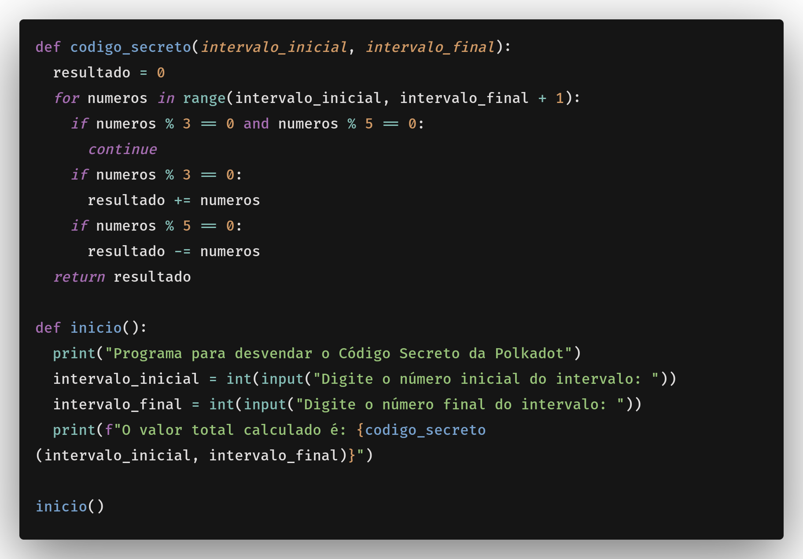

# Explicação do desafio

## Imagem do código:


Primeiramente, o código é dividido em partes, possuindo 2 funções:

- codigo_secreto(intervalo_inicial, intervalo_final)
- inicio()

A função inicio() é responsável por solicitar ao usuário o intervalo inicial e final, e então chamar a função codigo_secreto() para calcular o valor total.

A função codigo_secreto recebe dois parâmetros, intervalo_inicial e intervalo_final, que representam o intervalo de números que serão considerados para o cálculo do valor total. Na função, o código é dividido em três blocos:


### Primeiro bloco (loop):
```python
for numeros in range(intervalo_inicial, intervalo_final + 1):
```
Esse bloco itera sobre todos os números dentro do intervalo especificado, incluindo os extremos.

### Segundo bloco (condição):
```python
if numeros % 3 == 0 and numeros % 5 == 0:
	continue
```
Esse bloco verifica se o número atual é divisível por 3 e por 5, e se for, ele continua o loop.

### Terceiro bloco (condição):
```python
if numeros % 3 == 0:
	resultado += numeros
```
Esse bloco verifica se o número atual é divisível por 3, e se for, ele adiciona o número ao resultado.

### Quarto bloco (condição):
```python
if numeros % 5 == 0:
	resultado -= numeros
```
Esse bloco verifica se o número atual é divisível por 5, e se for, ele subtrai o número do resultado.

### O resultado final é retornado pela função:
```python
return resultado
```

## Rodando o código:
Rodando o código ele irá solicitar o intervalo inicial e final, e então calcular o valor total. Colocando o valor inicial como 1 e o final como 10, o resultado será o valor total de 3. Como no exemplo abaixo:

```python
Programa para desvendar o Código Secreto da Polkadot
Digite o número inicial do intervalo: 1
Digite o número final do intervalo: 10
O valor total calculado é: 3
```
